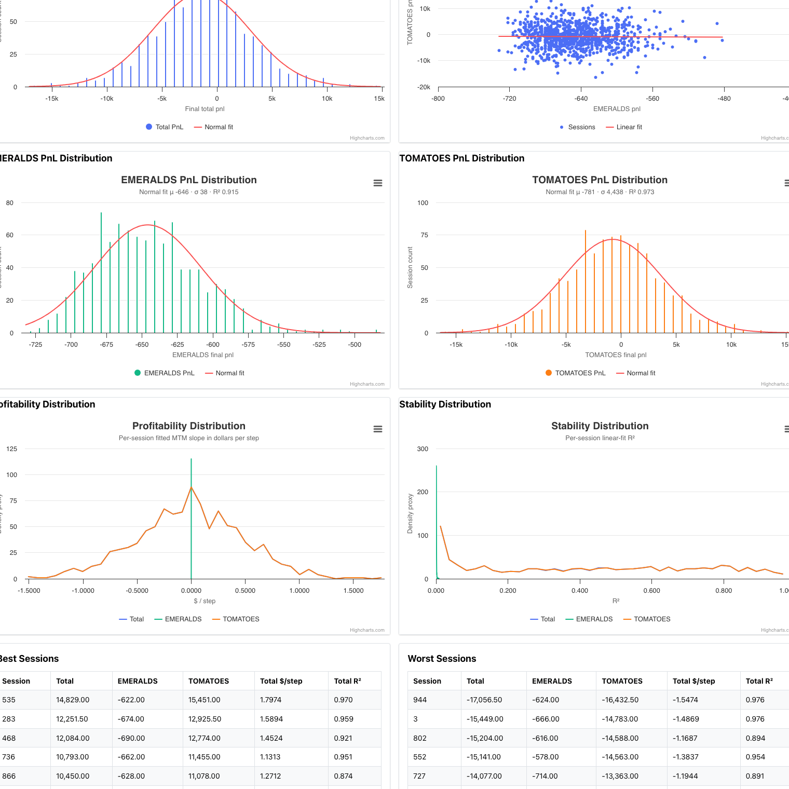
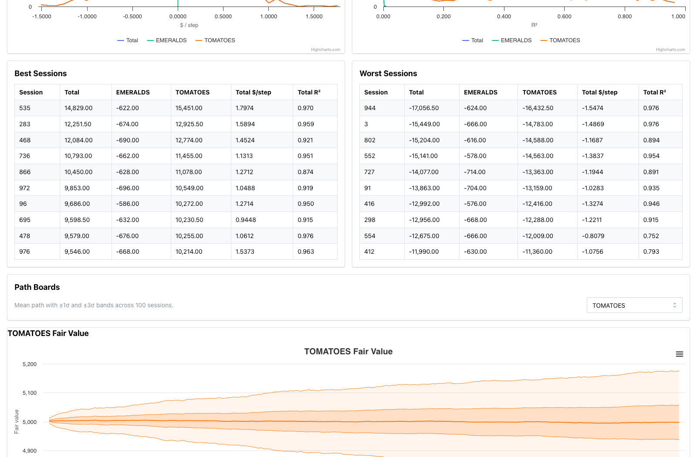

# IMC Prosperity 4 Monte Carlo Backtester

Rust-backed Monte Carlo backtesting for IMC Prosperity 4 tutorial-round strategies.

This repo gives you:

- `prosperity4mcbt`: a drop-in Monte Carlo CLI for normal Prosperity Python traders
- a local dashboard for PnL distributions, profitability, stability, and path bands
- a legacy replay CLI for historical CSV playback
- tutorial-round simulation models for `EMERALDS` and `TOMATOES`

You do not need to rewrite your trader for Monte Carlo mode. If your file already exposes a normal `Trader.run(state)` method, it should run.

## What Works Right Now

- Tutorial-round products: `EMERALDS`, `TOMATOES`
- One-day Monte Carlo sessions: `10,000` steps per session
- Default run: `100` sessions, `10` saved path traces
- Heavy preset: `1000` sessions, `100` saved path traces
- Local Monte Carlo dashboard
- Historical replay through the legacy compatibility CLI

## Prerequisites

You need:

- Python `3.9+`
- `uv`
- Rust / Cargo
- Node / npm

Monte Carlo runs call the Rust simulator, and the dashboard is a local Vite frontend.

## 60-Second Start

```bash
git clone https://github.com/chrispyroberts/imc-prosperity-4.git
cd imc-prosperity-4/backtester
uv venv
uv sync
source .venv/bin/activate
uv pip install -e .
cd ..
```

Run a quick Monte Carlo sweep:

```bash
source backtester/.venv/bin/activate
prosperity4mcbt your_trader.py --quick --out tmp/your_run/dashboard.json
```

Run the default sweep:

```bash
source backtester/.venv/bin/activate
prosperity4mcbt your_trader.py --out tmp/your_run/dashboard.json
```

Run the heavy sweep:

```bash
source backtester/.venv/bin/activate
prosperity4mcbt your_trader.py --heavy --out tmp/your_run/dashboard.json
```

Start the visualizer:

```bash
cd visualizer
npm install
npm run dev
```

Then run your backtest with `--vis`:

```bash
cd ..
source backtester/.venv/bin/activate
prosperity4mcbt your_trader.py --quick --vis --out tmp/your_run/dashboard.json
```

That uses the built-in CORS-enabled file server and opens the Monte Carlo route automatically.

For the common local case, the short URL is just:

```text
http://127.0.0.1:5555/
```

That works because the local visualizer proxies `/dashboard.json` and the related sidecar files to the local dashboard file server on port `8001`.

If you just want a smoke test, run the bundled starter template unchanged:

```bash
source backtester/.venv/bin/activate
prosperity4mcbt example_trader.py --quick --out tmp/example/dashboard.json
```

## CLI Presets

`prosperity4mcbt` supports two useful presets:

- default
  - `100` sessions
  - `10` sample sessions
- `--quick`
  - `100` sessions
  - `10` sample sessions
- `--heavy`
  - `1000` sessions
  - `100` sample sessions

Bare `prosperity4mcbt your_trader.py` now uses the quick-sized default:

```bash
prosperity4mcbt your_trader.py
```

You can still override counts manually:

```bash
prosperity4mcbt your_trader.py --sessions 3000 --sample-sessions 150
```

## What `sample-sessions` Means

- `sessions` controls how many Monte Carlo runs are used for the statistics
- `sample-sessions` controls how many full path traces are saved for the dashboard charts

So:

- bigger `sessions` improves the statistical estimates
- bigger `sample-sessions` makes the dashboard heavier

## Strategy Contract

Your strategy only needs to expose the normal Prosperity interface:

```python
class Trader:
    def run(self, state):
        return orders, conversions, trader_data
```

`prosperity4mcbt` handles:

- order book generation
- trade simulation
- path tracing
- cash / position accounting
- mark-to-market PnL
- dashboard bundle generation

No special visualizer logger is required for Monte Carlo mode.

Compatible import styles:

- `from datamodel import ...`
- `from prosperity3bt.datamodel import ...`
- `from prosperity4mcbt.datamodel import ...`

Tutorial-round Monte Carlo currently provides empty observations and does not simulate conversions, because the tutorial products do not use them.

## How It Works

The Monte Carlo engine is built from the tutorial-round CSVs in `data/round0/`. The goal is not to replay the exact two observed days, but to reproduce the same visible market structure and trade distributions with a simple generative model.

### 1. Fair value model

- `EMERALDS` uses a fixed fair value:
  - `F_t = 10000`
- `TOMATOES` uses a zero-drift latent fair process:
  - `x_{t+1} = x_t + ε_t`

The TOMATOES process is calibrated from the tutorial data so the simulated visible book reproduces the observed stationary-vs-drifting behavior and the same rough spread / trade statistics.

### 2. Order book placement bots

Each step starts by generating bot quotes around fair value.

- Bot 1 posts the outer symmetric wall
- Bot 2 posts the inner symmetric wall
- Bot 3 optionally posts a one-sided inside quote

The same architecture is used on both products, with product-specific parameters inferred from the data:

- `EMERALDS`
  - outer wall around `F_t ± 10`
  - inner wall around `F_t ± 8`
- `TOMATOES`
  - outer wall around `x_t ± 8`
  - inner wall around `x_t ± 6.5`
  - an optional one-sided inside bot near fair

Visible integer prices come from deterministic rounding of those quote targets, which is why the tutorial book shows stable discrete patterns instead of arbitrary noise.

### 3. Bot trade flow

After the book is built:

- your `Trader.run(state)` sees the bot-only book
- your orders cross immediately if marketable
- your resting orders stay in the book
- simulated bot takers then hit the best bid / ask

Trade timing, side mix, and size distributions are sampled from statistics measured from the tutorial trade CSVs, so the fill process matches the observed tutorial market more closely than a generic random-execution model.

### 4. Parameter inference

The simulator parameters come from direct measurement of the tutorial files:

- fair-value behavior from the two tutorial price paths
- wall spreads and sizes from repeated order book states
- Bot 3 presence, side, and size from one-sided inside quotes
- taker timing, side, and size from the trade logs

## Output Bundle

A run writes:

- `dashboard.json`
- `session_summary.csv`
- `run_summary.csv`
- `sample_paths/`
- `sessions/`

Typical command:

```bash
prosperity4mcbt your_trader.py --out tmp/your_run/dashboard.json
```

## Dashboard Screenshots

### Overview and summary metrics


### Distributions and cross-product diagnostics



### Best/worst session tables



### Path boards


## Baseline Monte Carlo Results

The repo includes the official IMC starter trader template in [example_trader.py](example_trader.py). That file still uses `acceptable_price = 10`, so it is intentionally a bad strategy until you replace its fair-value logic.

To make the README concrete, the official IMC starter trader was run with the heavy preset:

- `1000` sessions
- `100` sample sessions
- single-day sessions
- tutorial-round simulation model

### Official Starter Baseline

| Strategy | Mean Total PnL | Total PnL Std | P05 | P95 | Profitability | Stability `R²` | EMERALDS Mean PnL | TOMATOES Mean PnL |
| --- | ---: | ---: | ---: | ---: | ---: | ---: | ---: | ---: |
| IMC starter `example_trader.py` | `-1,427.08` | `4,437.36` | `-8,840.35` | `5,764.00` | `-0.0114 $/step` | `0.4273` | `-645.95` | `-781.13` |

Interpretation:

- the official starter trader is just a template, not a competitive baseline
- its `acceptable_price = 10` placeholder makes it systematically wrong for tutorial-round products

## Performance

Measured on this machine:

- `prosperity4mcbt example_trader.py --heavy`
- `1000` sessions
- `100` sample sessions

Observed runtime:

- wall time: `55.70s`
- effective CPU utilization: about `10.3x`
- machine logical CPUs: `14`

Parallelization model:

- Monte Carlo sessions run in parallel with Rayon
- each session is independent
- parallelism happens across sessions, not inside a single session

## Historical Replay

This repo still includes the legacy replay CLI for standard CSV playback:

```bash
source backtester/.venv/bin/activate
prosperity3bt your_trader.py 0 --data data
```

Use `prosperity3bt` if you want historical replay.

Use `prosperity4mcbt` if you want Monte Carlo simulation.

## Repo Layout

```text
prosperity4/
├── backtester/         # Python CLIs and dashboard bundle builder
├── rust_simulator/     # Rust simulation engine
├── visualizer/         # local visualizer frontend
├── scripts/            # helper scripts and Python strategy worker
├── data/               # tutorial-round CSV data
├── example_trader.py   # official IMC starter trader template
├── starter.py          # simple example strategy
├── test_algo.py        # simple local test strategy
└── docs/               # README screenshots
```

## Mark-to-Market

`MTM` means mark-to-market.

It answers one question:

- what is the strategy worth right now?

Formula:

```text
cash + open inventory valued at current fair value
```

## Attribution

This project includes adapted components from jmerle's open-source IMC Prosperity 3 tooling:

- backtester lineage: https://github.com/jmerle/imc-prosperity-3-backtester
- visualizer lineage: https://github.com/jmerle/imc-prosperity-3-visualizer

The historical replay CLI and parts of the visualizer shell started from those projects and were then modified for Prosperity 4 research. The Rust simulator, Monte Carlo engine, dashboard data model, tutorial-round market-structure analysis, and the Monte Carlo visualizer route are original additions in this repo.

## Open-Source Hygiene

Do not commit:

- `.env.local`
- `tmp/`
- `rust_simulator/target/`
- `visualizer/dist/`

Local auth tokens live outside the repo in `~/.prosperity4mcbt/`.

## Status

This repo is tuned for tutorial-round research and fast local experimentation. The Monte Carlo simulator is intended for strategy comparison and robustness testing, not as a claim of exact official-market reconstruction.
